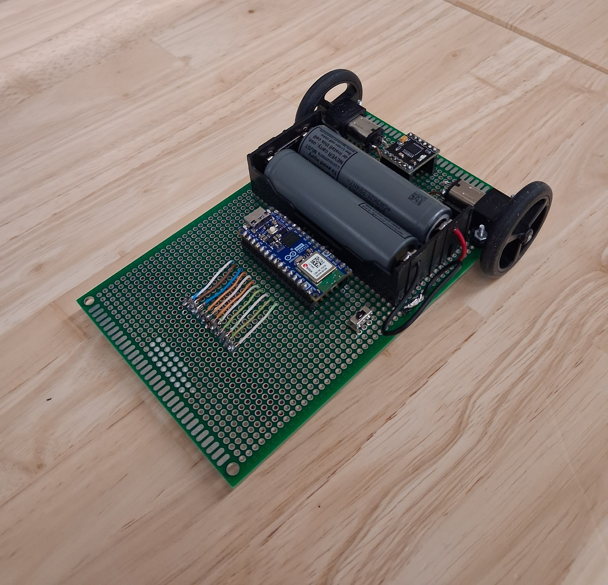

# LineFollower

  
## specifications

microcontroller: Arduino® Nano ESP32

motors: 50:1 Micro Metal Gearmotor HP 6V

h-bridge: DRV8833

sensors: QTR-8A

batteries: 2x 18650 Li-ion 2200mAh 3.7V

wireless communication: Arduino® Nano ESP32

distance sensor - motors: 11 cm

weight: 250 gram

speed: 0,42 m/s

